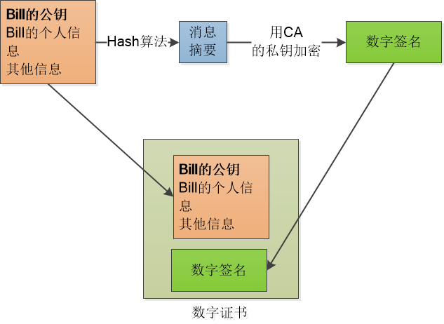
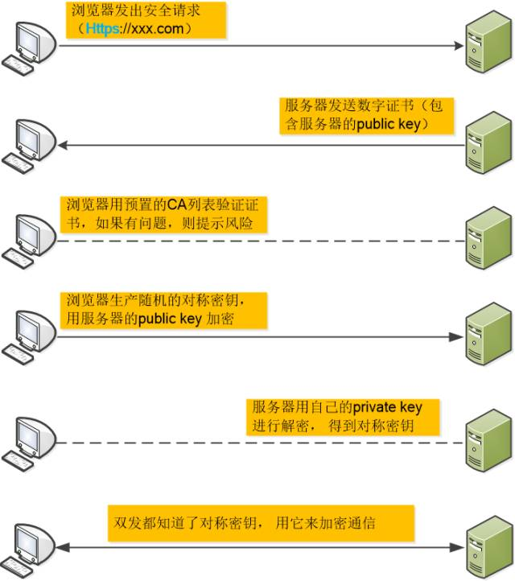

# https的相关事宜

链接：[一个故事讲完https](https://mp.weixin.qq.com/s/StqqafHePlBkWAPQZg3NrA)

- 无任何加密在互联网上进行信息交换是一种及其危险的做法，网络加密应运而生。对报文进行各种加密码，是http-https的历史

- 对称加密

	- 1、加密和解密算法是公开的，密文是保密的。
	- 2、但是密钥却不能保证其安全得发送到对方。

- 非对称加密码，RSA算法

	- 1、公钥是公开的，私钥是本地的，公钥加密的文件只有对应的私钥才能打开。
	- 2、加密慢，效率低。

- 非对称加密+对称加密

	- 1、使用RSA算法（非对称加密）对 对称加密 算法的密钥进行加密。
	- 2、这样就减少了对整体信息的加密而产生的时间。
	- 3、如果第三方在中间冒充对方，如果知道公钥，那这个方法将是徒劳。问题出现在公钥的分发上。

- 数字签名，数字证书，证书验证

	 - 1、拿到数字证书后，信息进行hash算法生成数字信息摘要。再用CA公钥对数字签名进行解密得到数字摘要。两者相同则信息安全。
	
		

## https

